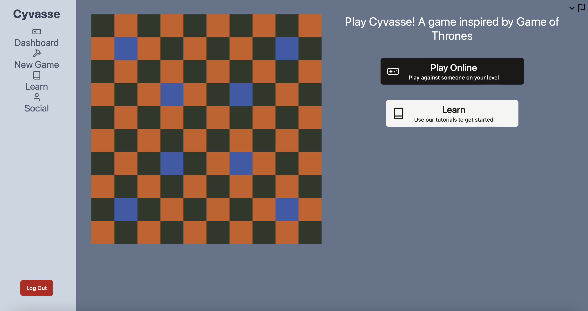
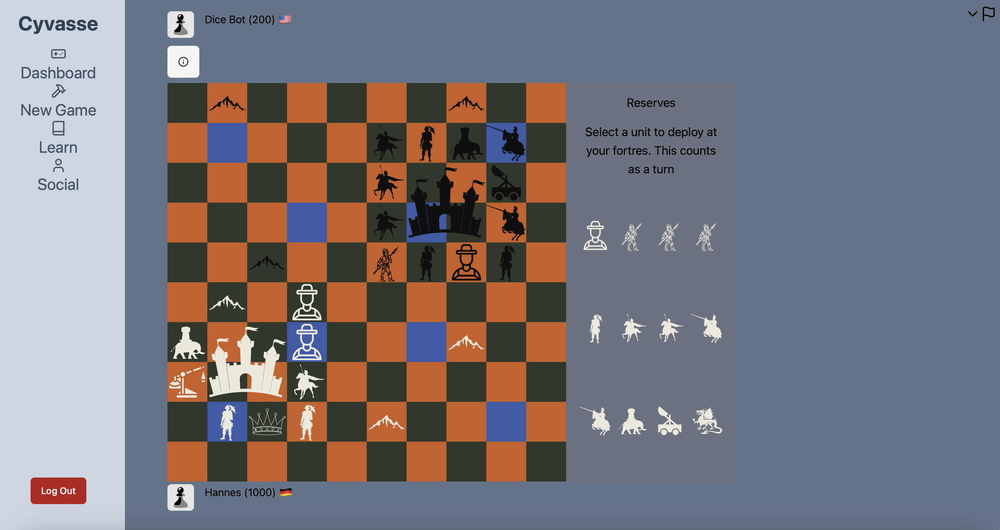

# Cyvasse

This project offers an application to play "Cyvasse", a turn-based chess-like board game, online.
Home Screen:

Play Area:


## Project Structure 
In this Repo youll find two main folders: 
1. "cyvasse-backend" contains all files regarding the python/flask backend server as well as the local Dev DB
2. "cyvasse-frontend "contains the react/typescript source code for the frontend 

Addionally 
1. "documentation" containing some addional material for readme, etc.
2. "nginx" the config file for the prod nginx server


### Congfigs
The backend config can be in cyvasse-backend/webserver/config.py. Configurations that can or should be changed for deploy will be discussed in the docker sections, since they shouldnt be changed in this file.

## Docker
The project can be run as docker containers, this is easy and will work on any system that has docker installed. The dev compose file wont run the frontend, for it you have to refer to the local installation instructions.
Docker requires a env file, for this you can copy or rename the env_template to .env.dev
For locally running and testing you dont need to make any changes.


```bash
docker-compose up -d --build
```

To destroy the docker containers
```bash
docker-compose down -v
```

In case you want to recreate the db or get an empty one

Test Data:
```bash
docker-compose exec backend python manage.py create_db_withdev
```

Empty DB:

```bash
docker-compose exec backend python manage.py create_db
```


## Local Installation
For development and testing you can run the project locally as dev servers.
When locally running the application uses a .db file located in /cyvasse-backend/instances/db.db that serves as a local Database

### Frontend

Requirements:
- node
- npm

Install the packages via:

```bash
cd cyvasse-frontend
npm install
```

You can locally run the dev server via:

```bash
cd cyvasse-frontend
npm run dev
```

### Backend

Requirements:
- Python
- pip
- (Recommended) A virtual env off your choosing

With your virtual env set up and mounted run:

```bash
cd cyvasse-backend
pip install
```
You have to create the db via:

```bash
python manage.py create_db
```

You may also run this command to create some test data:

```bash
python manage.py create_db_withdev
```

You can run the backend-server via:

```bash
python app.py
```

